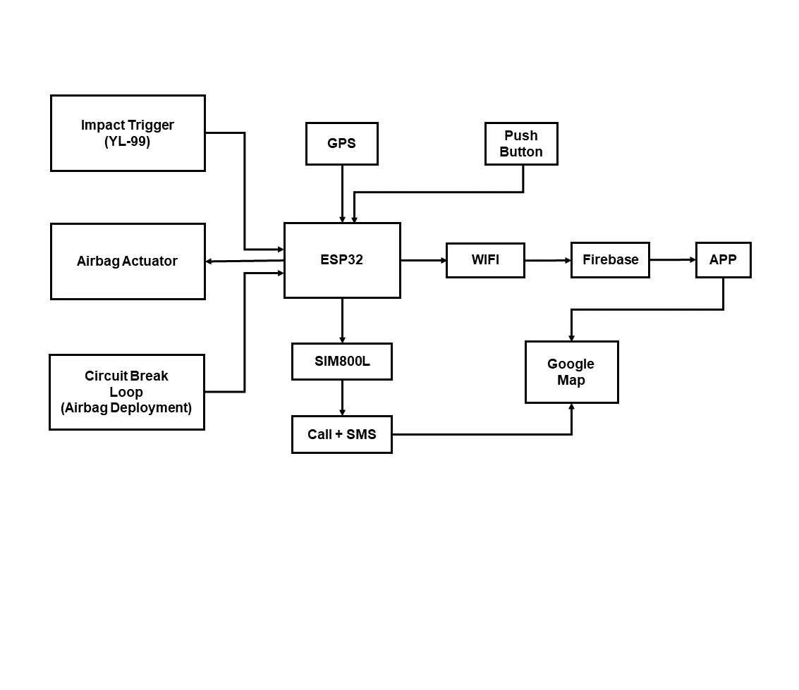
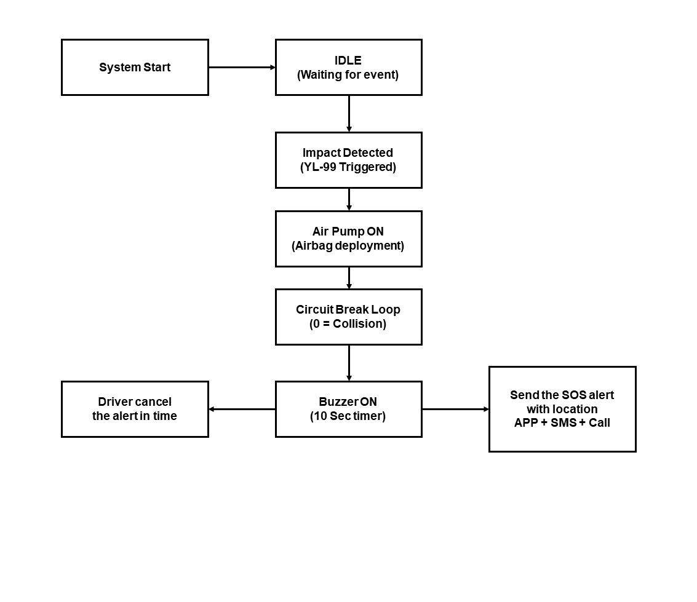
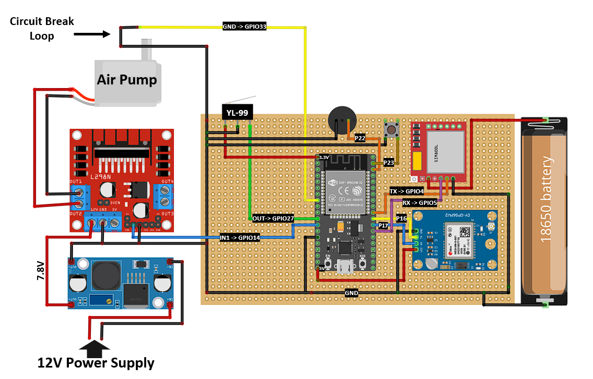
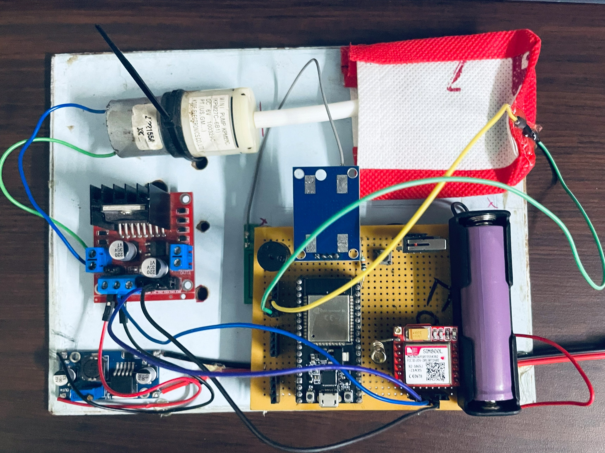
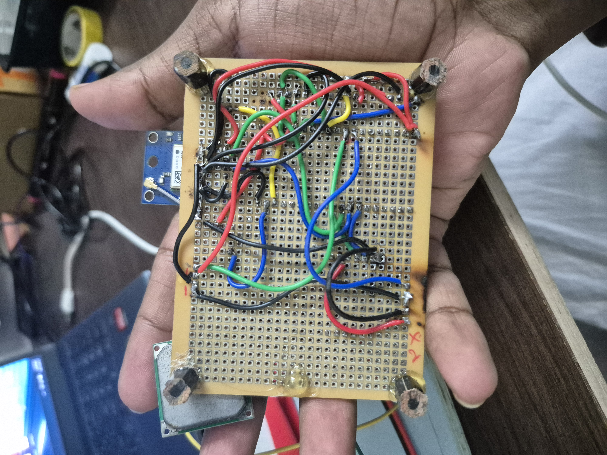
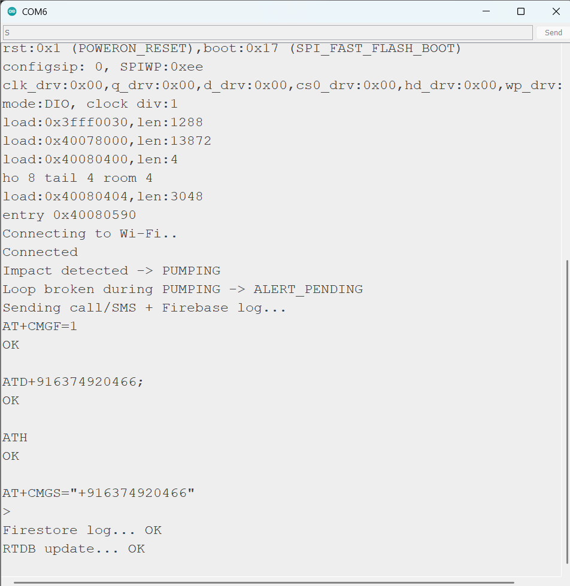
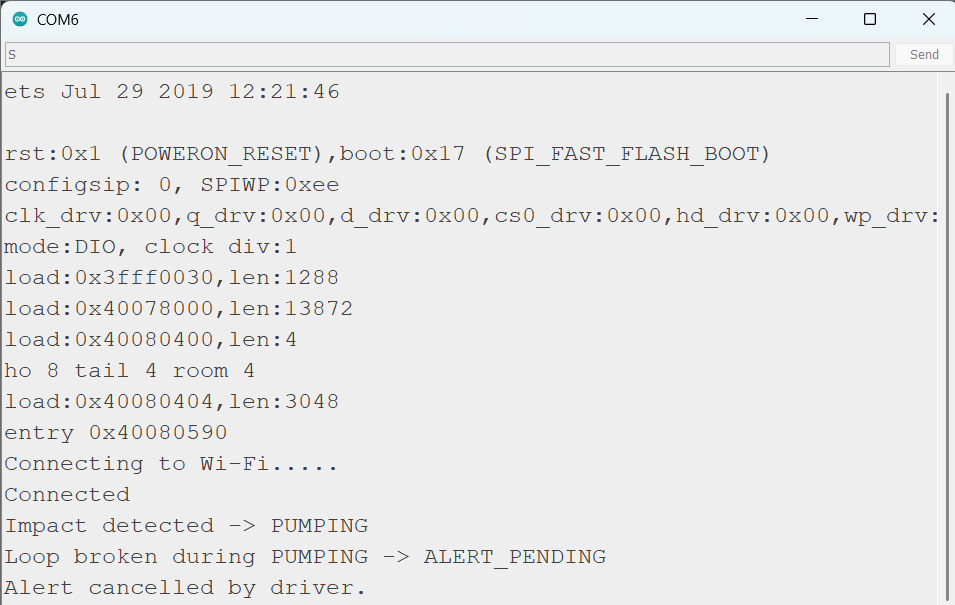

# 🚗 AutoCrash SOS – Final Version

AutoCrash SOS is an autonomous accident detection and emergency alert system inspired by the **real airbag deployment mechanism used in modern vehicles**.

This system detects collision events using a **detachable circuit loop trigger placed above the airbag**, and automatically sends emergency alerts with GPS location to family members and ambulance application.

The project was developed using ESP32, GSM communication, GPS and a physical airbag-inspired trigger prototype.

---

# 🧠 Core Idea

vehicles deploy airbags during severe collisions.  
When the airbag deploys, internal mechanical structures move or break due to deployment pressure.

Inspired by this mechanism, this project implements a detachable conductive loop placed above the steering airbag area.

### Trigger Concept

• A conductive jumper wire forms a closed circuit loop  
• When the simulated airbag deploys, the wire disconnects  
• The loop breaks → logic changes to **Collision = 0**  
• ESP32 detects this state and triggers emergency alert

This provides a **simple and reliable hardware trigger for accident detection**.

---

# ⚙️ System Architecture

The system integrates sensors, communication modules, and emergency notification services.

---

# 🔄 System Flow

1. System powers ON
2. Device enters idle state
3. Impact detected via YL-99 collision sensor
4. Air pump activates to simulate airbag deployment
5. Detachable loop breaks
6. Collision confirmed
7. Buzzer countdown allows driver to cancel alert
8. If not cancelled:
   - GPS coordinates retrieved
   - SMS + Call sent via GSM
   - Alert sent to ambulance response application

---

# 🔌 Circuit Diagram

---

# 🔧 Hardware Components

Main controller

• ESP32

Communication

• SIM800L GSM module

Location

• Neo-6M GPS module

Collision Detection

• YL-99 Impact Sensor
• Circuit break loop (detachable wire)

Actuation

• L298N Motor Driver
• 6V Air Pump (airbag simulation)

User Interaction

• Push Button (manual cancel)
• Buzzer

Power

• 12V supply
• LM2596 Buck Converter
• 18650 Li-ion battery for GSM module

---

# 🧪 Prototype Hardware

### Hardware Setup

### PCB Wiring

---

# 📱 Ambulance Response App

The system also sends accident alerts to a mobile application used by ambulance drivers.

### App Interface

The app displays:

• Accident location  
• Allocation status  
• Navigation option to reach accident site via google maps  

---

# 📡 System Output

### Successful Alert Trigger

### Driver Cancel Scenario

---

# 🚨 Emergency Alert Features

When an accident is detected:

• SMS sent with GPS coordinates  
• Phone call placed to emergency contact  
• Alert logged and shared with ambulance response application  

---

# 👥 Contributors

This project was developed collaboratively.

- ### Hardware - **[Noorul Hassan](https://github.com/noorul23)**  
- ### Software (Ambulance App) - **[Muhammad Thahir](https://github.com/Thahir25)**  

---

## License
This project is licensed under->[MIT License](https://github.com/noorul23/autocrash-sos-final/blob/main/LICENSE), please check it out before using this resource.

---

If you find this project useful, feel free to ⭐ the repository!
