# AutoCrash SOS – IoT-Based Autonomous Crash Alert System

An IoT-based accident detection and emergency alert system developed using ESP32, SIM800L, and Neo-6M GPS. The system uses an airbag-inspired circuit-break mechanism for collision detection and emergency alert activation, with GPS-based emergency notifications sent to predefined contacts and a companion Android application.

## Overview

AutoCrash SOS was developed as an embedded IoT system combining collision detection, physical actuation, GPS location acquisition, GSM communication, and mobile-based emergency notification.

The system was developed from an initial internship prototype and subsequently extended into a hardware-based implementation with an airbag-inspired circuit-break mechanism, prototype hardware, PCB design, and an ambulance response application.

## Problem / Motivation

In a vehicle accident, detecting a collision and communicating the location of the incident quickly can be important for initiating emergency assistance.

The project explores an embedded approach in which a collision event activates a physical trigger mechanism and automatically initiates location-based emergency communication.

## System / Solution

The system uses an ESP32 as the primary controller.

A YL-99 impact sensor initiates the collision sequence, after which an airbag-inspired mechanism is activated using an air pump. A detachable conductive circuit loop is used as the collision confirmation mechanism. When the simulated airbag deployment causes the loop to break, the ESP32 detects the change in circuit state and proceeds with the emergency alert sequence.

A buzzer provides a short cancellation period for the driver. If the alert is not cancelled, the system retrieves GPS coordinates and uses the SIM800L GSM module to transmit emergency notifications.

The system also communicates the accident information to a companion ambulance response application, where the reported accident location and allocation status can be viewed.

## Key Features

- ESP32-based accident detection and control
- Airbag-inspired circuit-break mechanism for collision detection
- YL-99 impact sensor for collision triggering
- Physical airbag deployment simulation using an air pump
- GPS-based location acquisition using Neo-6M
- GSM-based emergency communication using SIM800L
- SMS and phone-call emergency alerts
- Driver alert cancellation through a push button
- Buzzer-based alert countdown
- Emergency alert sharing with a companion ambulance application
- Prototype PCB design and hardware integration

## System Architecture

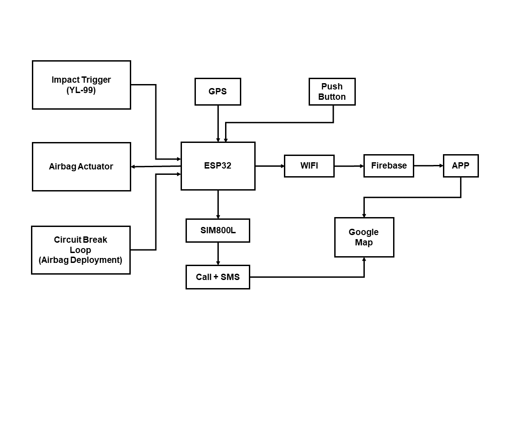

The system integrates the collision detection mechanism, ESP32 controller, GPS, GSM communication, physical actuation, and the ambulance response application.

## System Flow

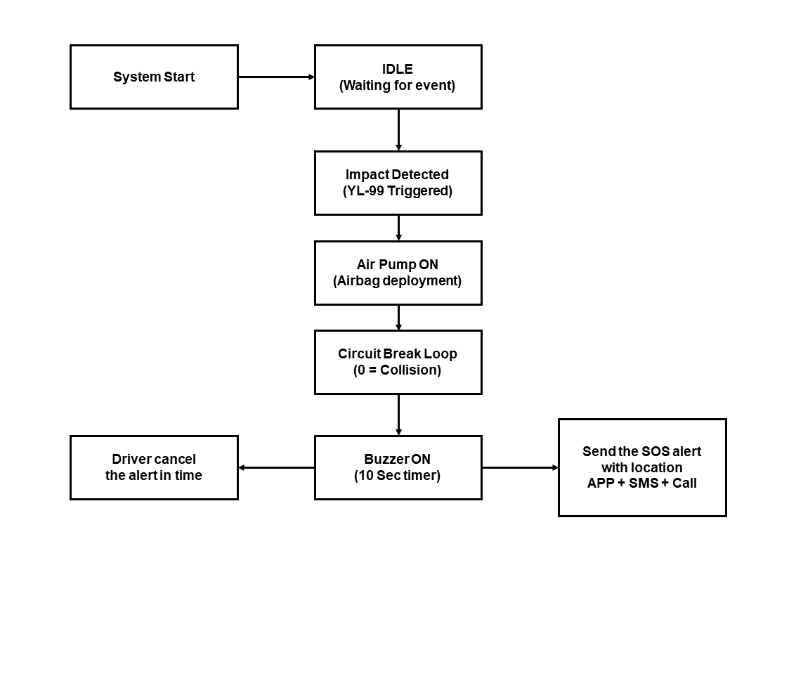

1. System powers on and enters the idle state.
2. A collision event is detected through the YL-99 impact sensor.
3. The air pump is activated to simulate airbag deployment.
4. The detachable circuit loop breaks during the deployment sequence.
5. The ESP32 detects the circuit-break condition and confirms the collision event.
6. The buzzer starts a short alert period.
7. The driver can cancel the alert using the push button.
8. If the alert is not cancelled, the system retrieves the GPS location.
9. Emergency notifications are transmitted through the SIM800L GSM module.
10. The accident information is also made available to the ambulance response application.

## Circuit Design

### Circuit Diagram

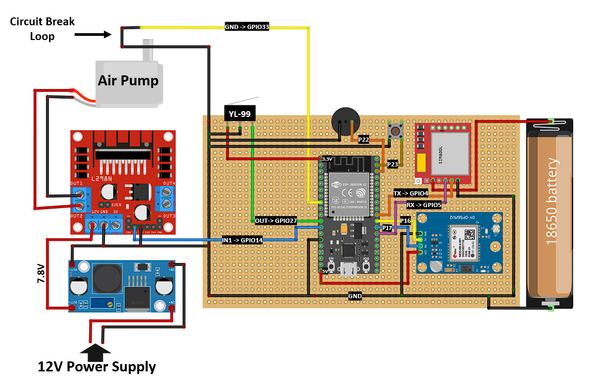

### Schematic

The schematic documents the controller, power conversion, GSM, GPS, buzzer, motor driver, push button, and circuit-break interfaces used in the prototype.

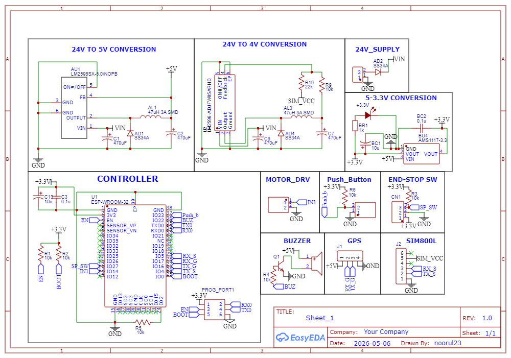

## Hardware Components

### Controller
- ESP32

### Communication
- SIM800L GSM Module

### Location
- Neo-6M GPS Module

### Collision Detection
- YL-99 Impact Sensor
- Detachable circuit-break loop

### Actuation
- L298N Motor Driver
- 6V Air Pump

### User Interaction
- Push Button
- Buzzer

### Power
- 12V Power Supply
- LM2596 Buck Converter
- 18650 Li-ion Battery

## Prototype Hardware

The system was assembled and tested as a physical prototype before developing the PCB design.

### Prototype Setup

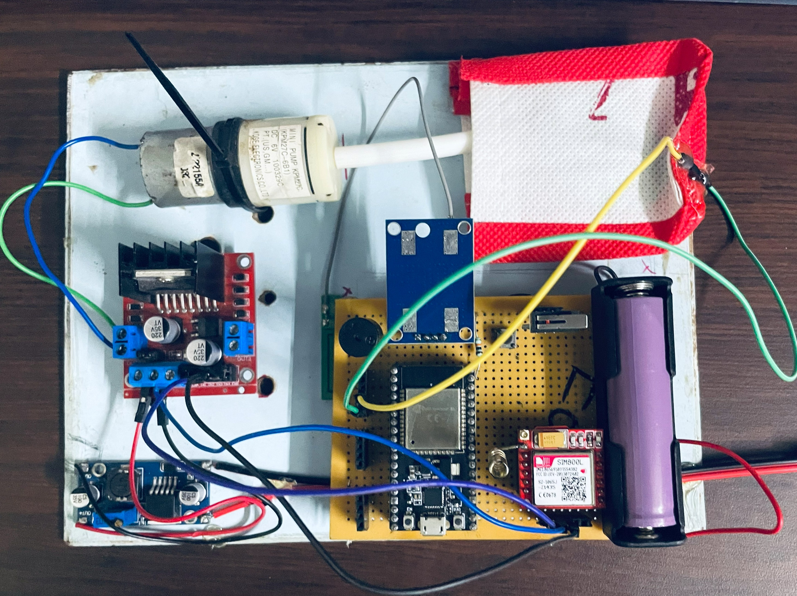

### Prototype Wiring

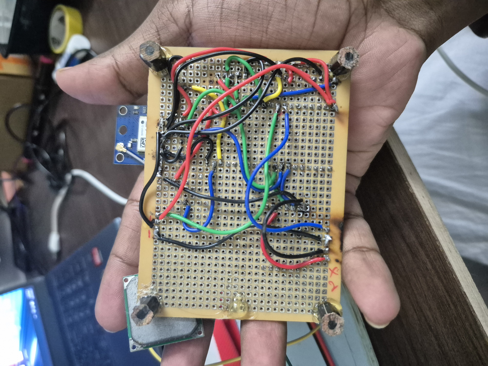

## PCB Design

A PCB design was developed to integrate the major components of the system into a more structured hardware layout.

The PCB shown in this repository represents the design and prototype stage of the project and is not presented as a manufactured production board.

### PCB Layout

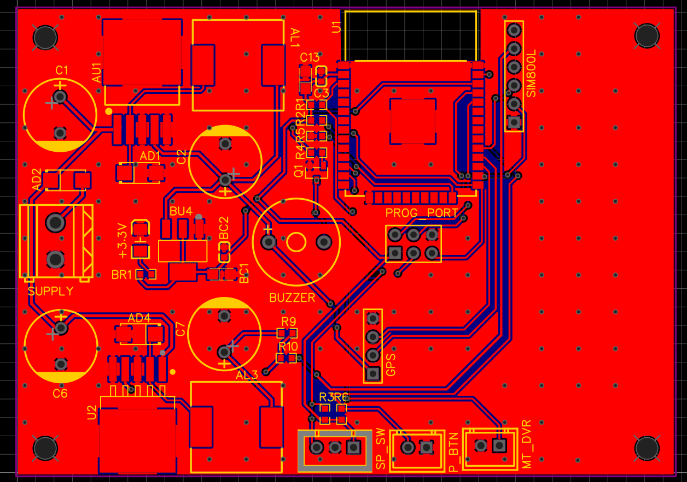

### 3D PCB View

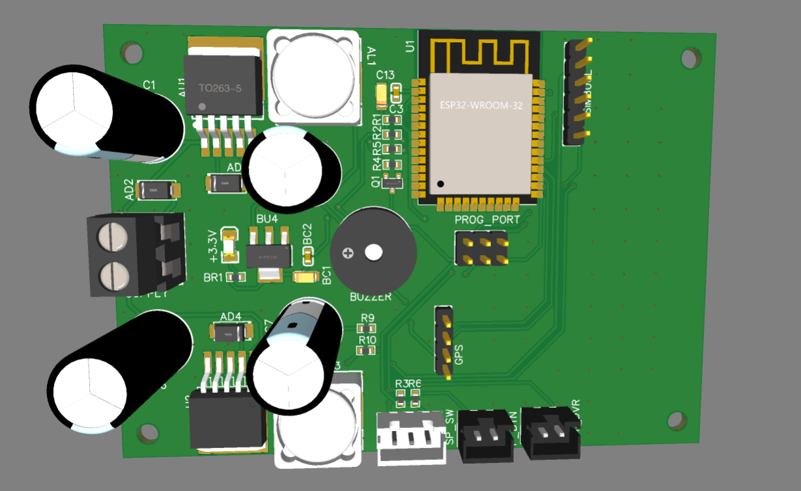

## Ambulance Response Application

A companion Android application was developed to receive and display GPS-based emergency alerts.

The application provides an interface for viewing reported accident locations, allocation status, and navigation to the reported location.

### Application Interface

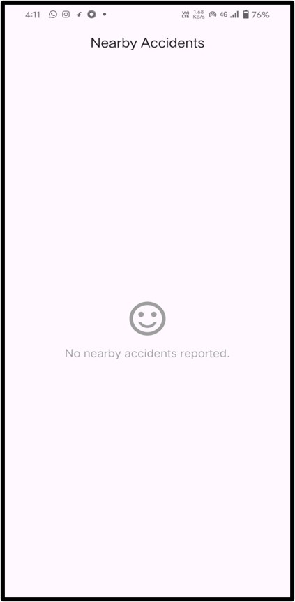

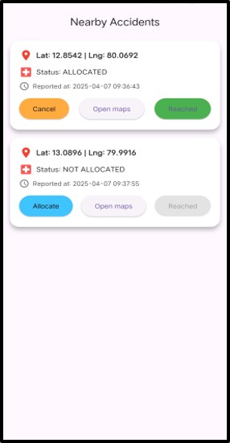

## System Output

### Emergency Alert Trigger

The serial output demonstrates the system detecting the collision sequence, confirming the circuit-break condition, and initiating GSM communication and application logging.

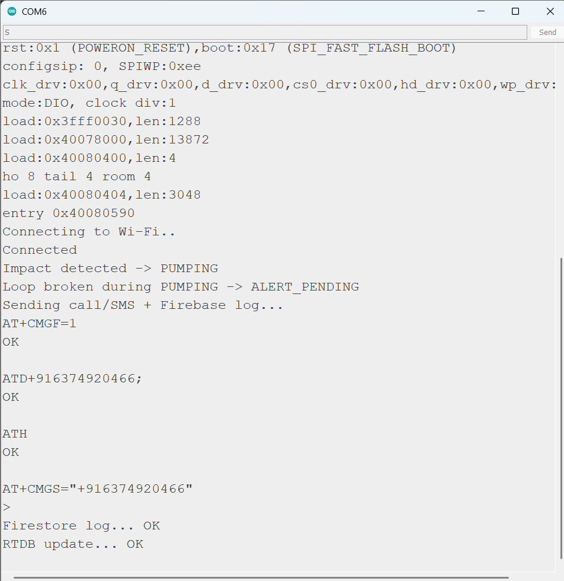

### Alert Cancellation

The system also provides a cancellation path that allows the driver to cancel the emergency alert during the alert period.

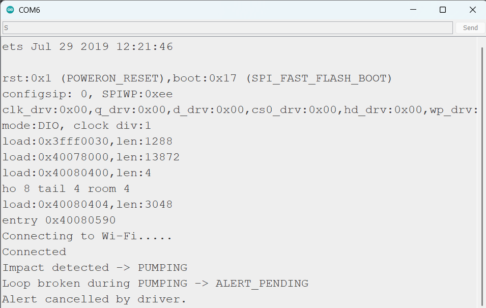

## Emergency Alert Sequence

When an accident is confirmed and the alert is not cancelled:

- GPS coordinates are acquired.
- An SMS alert is transmitted through the SIM800L module.
- A phone call is initiated to the predefined emergency contact.
- The accident information is logged and shared with the companion ambulance response application.

## Implementation

The firmware implements the system control sequence, including:

- collision event detection
- air pump activation
- circuit-break monitoring
- buzzer timing
- alert cancellation
- GPS coordinate acquisition
- GSM communication
- emergency alert transmission
- communication with the application backend

The main firmware source is available in the `firmware/` directory.

## Project Contribution

Hardware — - **[Noorul Hassan](https://github.com/noorul23)**  

-	Hardware integration 
-	Firmware development 
-	Circuit troubleshooting 
-	PCB prototyping 
-	System testing 

Software — **[Muhammad Thahir](https://github.com/Thahir25)**

-	Ambulance response application

## Future Improvements

Potential future improvements include further hardware refinement, integration, and testing of the prototype for practical deployment scenarios.

License

This project is licensed under->[MIT License](https://github.com/noorul23/autocrash-sos-final/blob/main/LICENSE), please check it out before using this resource.

## Repository Structure

```text
autocrash-sos-final/
│
|
|── docs/
│   └── AutoCrash SOS technical report
|
├── firmware/
│   └── AutoCrash SOS firmware
│
├── hardware/
│   ├── architecture
│   ├── system flowchart
│   ├── circuit diagram
│   ├── schematic
│   ├── PCB design
│   └── 3D PCB view
│
├── images/
│   ├── prototype images
│   ├── application screenshots
│   └── system output
│
├── media/
│   └── demo video reference
│
├── LICENSE
└── README.md

